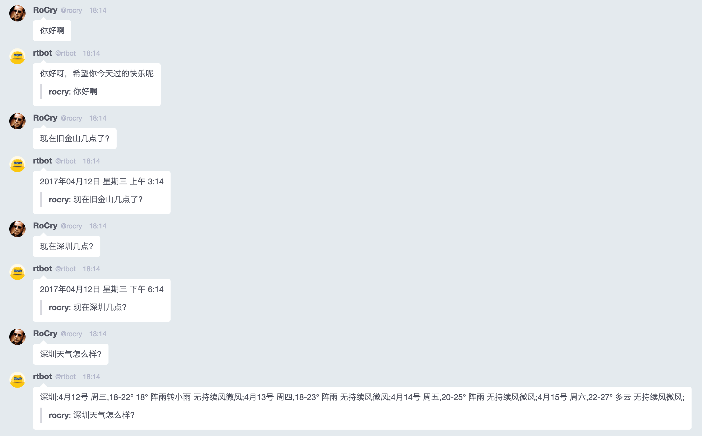

效果: 

用法: 
* `go get -u -v github.com/bcho/bearychat.go`
* `go get -u -v github.com/bitly/go-simplejson`
* `go run main.go --rtmToken RTM_TOKEN_HERE --tulingToken TULING_TOKEN_HERE`

> 其中 
* `rtmToken` 用的是 BearyChat hubot 机器人的 token
* `tulingToken` 是在 [http://www.tuling123.com/](http://www.tuling123.com/) 申请的 APIkey